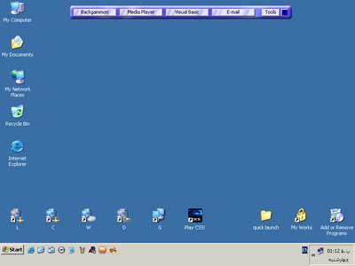

<div align="center">

## Quick Launch


</div>

### Description

This is a Beautiful Quicklaunch than have 4 button and you can put any program on this buttons.

you can put this quicklaunch on anywhere of your desktop.
 
### More Info
 


<span>             |<span>
---                |---
**Submitted On**   |2006-03-29 00:17:50
**By**             |[San Arena](https://github.com/Planet-Source-Code/PSCIndex/blob/master/ByAuthor/san-arena.md)
**Level**          |Intermediate
**User Rating**    |4.7 (14 globes from 3 users)
**Compatibility**  |VB 6\.0
**Category**       |[Miscellaneous](https://github.com/Planet-Source-Code/PSCIndex/blob/master/ByCategory/miscellaneous__1-1.md)
**World**          |[Visual Basic](https://github.com/Planet-Source-Code/PSCIndex/blob/master/ByWorld/visual-basic.md)
**Archive File**   |[Quick\_Laun1983803292006\.zip](https://github.com/Planet-Source-Code/san-arena-quick-launch__1-64840/archive/master.zip)

### API Declarations

```
ReleaseCapture
SendMessage
ShellExecute
SetLayeredWindowAttributes
UpdateLayeredWindow
GetWindowLong
SetWindowLong
```


